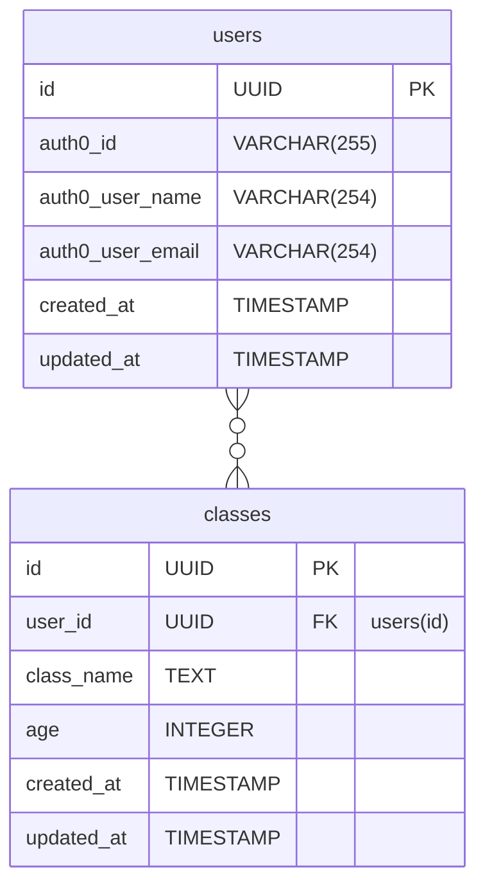

```mermaid
erDiagram
    users {
	    id UUID PK
        auth0_id VARCHAR(255)
        auth0_user_name VARCHAR(254)
        auth0_user_email VARCHAR(254)
        created_at TIMESTAMP
        updated_at TIMESTAMP
    }

	classes {
		id UUID PK
        user_id UUID FK "users(id)"
        class_name TEXT
        age INTEGER
        created_at TIMESTAMP
        updated_at TIMESTAMP
    }

    users }o--o{ classes: ""
```